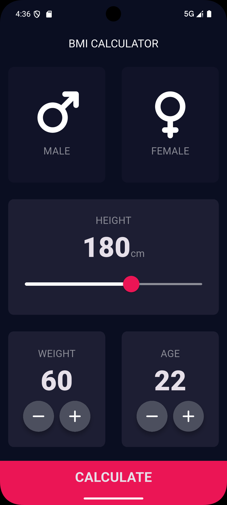
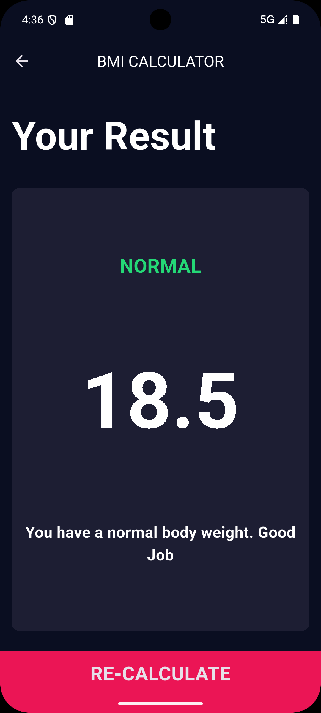

# BMI Calculator App

A simple mobile app built with Flutter to calculate Body Mass Index (BMI).  
This project demonstrates custom theming, reusable widgets, input handling, navigation, and basic calculation logic.

## Features

- Custom theme with styled title and body text
- Reusable card widget for consistent UI
- Interactive gender selection with gesture detection and dynamic color feedback
- Customized height slider with styled knob
- Reusable icon buttons for weight and age controls
- Functional increment/decrement for weight and age values
- Modular project structure with components and screens folders
- Results page UI displaying BMI value and category
- Navigation between input and results screens using Navigator
- Responsive design across devices

## Demo

<p align="center">
  
  
</p> 


## Download

Get the production-ready build without debug overhead:

- [Download APK](https://github.com/KaleabBantayehu/bmi-calculator-app/releases/latest)


## Getting Started

1. **Clone the repository:**
   ```bash
   git clone https://github.com/KaleabBantayehu/bmi-calculator-app.git
   ```
2. **Navigate into the project folder**
   ```bash
   cd bmi-calculator-app
   ```
3. **Install dependencies:**
   ```bash
   flutter pub get
   ```

4. **Run the app:**
   ```bash
   flutter run
   ```

## License

This project is licensed under the MIT License.


